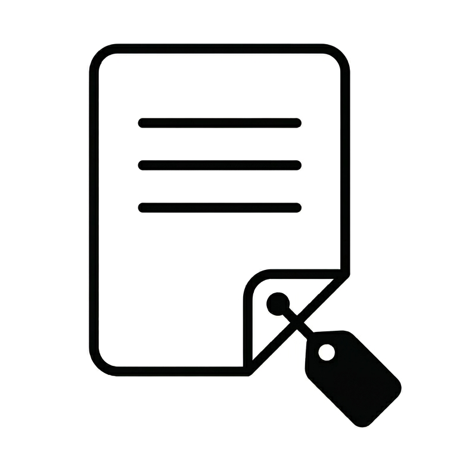

<p align="center">
  
</p>

<h1 align="center">NoteTag</h1>

<p align="center">
  <i>Privacy-first notes with Markdown, threads, and native GitHub sync.</i>
</p>

<p align="center">
  <a href="https://hub.docker.com/r/ilrubio/notetag">
    
  </a>
  <a href="https://hub.docker.com/r/ilrubio/notetag/tags">
    
  </a>
  <a href="LICENSE">
    
  </a>
</p>

NoteTag is a fast note-taking app inspired by Memos. Data is stored locally in the browser and can be synced to your own private GitHub repository, so you keep full ownership of your notes.

## Features

- GitHub auto-sync for create, update, and delete operations.
- Rich Markdown rendering with task lists and syntax highlighting.
- Nested replies to build threaded note conversations.
- Tag-based organization with quick filtering.
- Internal note linking.
- Focus mode composer.
- Mobile-optimized UI (drawer sidebar, bottom-sheet modals, floating action button).

## Tech Stack

- React + Vite + TypeScript
- Vanilla CSS
- Lucide React
- markdown-it + highlight.js
- GitHub REST API

## Getting Started

### 1) Clone

```bash
git clone https://github.com/rubinog/notetag_new.git
cd notetag_new
```

### 2) Install dependencies

```bash
npm install
```

### 3) Run in development

```bash
npm run dev
```

Open the URL shown in terminal (usually `http://localhost:5173`).

### 4) Run from phone on local network

```bash
npm run dev -- --host
```

Then open the LAN URL shown by Vite (example: `http://192.168.1.20:5173`) from your mobile device on the same Wi-Fi.

### 5) Production build

```bash
npm run build
npm run preview
```

## Docker Quick Start

Run NoteTag instantly from Docker Hub:

```bash
docker pull ilrubio/notetag:1.0.2
docker run -d --name notetag-app -p 8080:80 --restart unless-stopped ilrubio/notetag:1.0.2
```

App URL: `http://localhost:8080`

Stop and remove container:

```bash
docker rm -f notetag-app
```

## Docker Compose

Local build (from source):

```bash
docker compose up --build -d
```

Production-style run (from Docker Hub image):

```bash
docker compose -f docker-compose.prod.yml pull
docker compose -f docker-compose.prod.yml up -d
```

Multi-stage Docker build (Node -> Nginx).
Nginx serves static assets and handles SPA routing.

## Docker Hub

- Repository: https://hub.docker.com/r/ilrubio/notetag
- Recommended stable tag: `1.0.2`
- Rolling tag: `latest`

## Configure GitHub Sync

1. Create a private repository on GitHub (example: `my-notes`).
2. Create a Personal Access Token (PAT).

  Quick path (Classic token):
  - Open GitHub and go to `Settings` -> `Developer settings` -> `Personal access tokens` -> `Tokens (classic)`.
  - Click `Generate new token (classic)`.
  - Add a note like `notetag-sync` and choose an expiration date.
  - Enable scope `repo`.
  - Click `Generate token` and copy it immediately (GitHub shows it only once).

  Alternative path (Fine-grained token):
  - Go to `Settings` -> `Developer settings` -> `Personal access tokens` -> `Fine-grained tokens`.
  - Click `Generate new token`.
  - Select your account and restrict access to the repository used by NoteTag.
  - In `Repository permissions`, set `Contents` to `Read and write`.
  - Generate token and copy it immediately.

  Security note:
  - Treat the token like a password.
  - If exposed by mistake, revoke it and generate a new one.

3. In NoteTag, open Settings and fill:
   - Owner (GitHub username)
   - Repository name
   - Token
4. Save config.

## Useful Scripts

- `npm run dev` - start development server
- `npm run build` - type-check and create production build
- `npm run preview` - preview production build locally
- `npm run lint` - run ESLint

## 🤝 Contributing

Issues and pull requests are welcome! If you have ideas to improve NoteTag, feel free to open a PR.

## 📄 License & Attribution

This project is open source and available under the **MIT License**.

If you use this code, build upon it, or feature it in a project, I would greatly appreciate it if you could:
* Keep the original license and copyright notice.
* Provide a link back to this repository: [NoteTag by rubinog](https://github.com/rubinog/notetag_new).

---
<p align="center">
  Made with ❤️ by <a href="https://github.com/rubinog">rubinog</a>
</p>